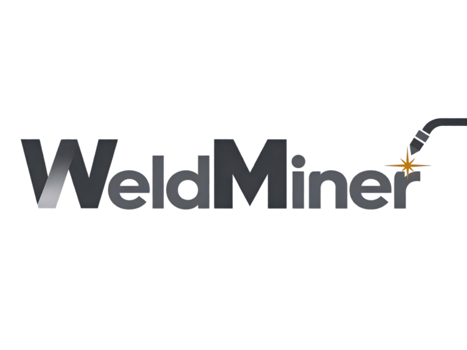
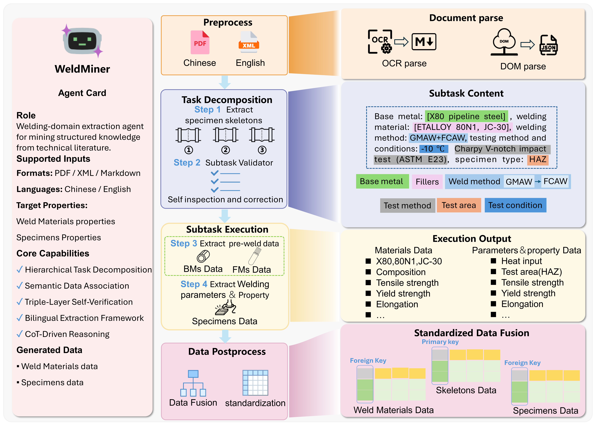

<p align="center">
  
</p>

# 

WeldMiner extracts specimen-level welding data from scientific literature, including base and filler materials, process conditions, and measured properties. The repository also includes a database-backed RAG interface and the L2M3-Weld comparison baseline.

<p align="center">
  
</p>

## Installation

Clone the [WeldMiner repository](https://github.com/MGEdata/WeldMiner) and install the package from the local source.

```bash
git clone https://github.com/MGEdata/WeldMiner.git WeldMiner_Code
cd WeldMiner_Code
python -m pip install "./WeldMiner[qwen]"
```

Use a dedicated Python environment and select the same interpreter in your IDE. `[qwen]` installs the Qwen client dependencies. For DeepSeek or Gemini, use `"./WeldMiner[deepseek]"` or `"./WeldMiner[google]"` instead.

Copy `.env.example` to `.env` and enter the credentials for your chosen provider:

```dotenv
QWEN_API_KEY=your_api_key
# Set the Qwen compatible API endpoint for your service region.
QWEN_API_BASE_URL=
DEEPSEEK_API_KEY=your_api_key
DEEPSEEK_API_BASE_URL=https://api.deepseek.com
GOOGLE_API_KEY=your_api_key
GOOGLE_API_BASE_URL=https://generativelanguage.googleapis.com
```

To use the RAG interface, also install the root dependencies:

```bash
python -m pip install -r requirements.txt
```

PDF parsing requires a separately prepared OCR environment and model service. Follow the [PaddleOCR documentation](https://www.paddleocr.ai/) and [PaddleOCR-VL guide](https://www.paddleocr.ai/main/en/version3.x/pipeline_usage/PaddleOCR-VL.html). OCR dependencies are not included in this repository's installation requirements.

## How to Use

### Extract welding data

Save the following as a Python script in the repository root. Edit the input path, model, and extraction targets, then run it directly in your IDE.

```python
from dotenv import load_dotenv
from weldminer import ExtractionConfig, ModelConfig, extract_file

load_dotenv(".env", override=False)

config = ExtractionConfig(
    material_user_goal=["hardness", "tensile strength", "yield strength"],
    material_direct_goal=[],
    sample_user_goal=["hardness", "tensile strength", "elongation", "impact energy"],
    sample_direct_goal=["microstructure"],
    llm=ModelConfig(provider="qwen", model="qwen3.7-max"),
    export_csv=True,
    export_excel=True,
)

record = extract_file(
    "input/paper.xml",
    config=config,
    output_dir="output",
    overwrite=False,
)
print(record["status"])
print(record["output_dir"])
```

`material_*` targets apply to base and filler materials; `sample_*` targets apply to specimens. `*_user_goal` selects property values, while `*_direct_goal` selects descriptive information. Empty lists disable the corresponding target category.

The input can be XML, Markdown, or TXT. Each paper receives a separate output directory containing the workflow result, intermediate outputs, and enabled CSV/Excel exports. Final records are available in `record["result"]["final_result"]`. Use `overwrite=True` to repeat an extraction; otherwise, identical successful runs are skipped.

### Parse PDF files

PDF conversion is a separate preprocessing step.

**Installation requirements**

Prepare a dedicated OCR environment with PaddleOCR and its PaddleOCR-VL dependencies, including a compatible PaddlePaddle inference engine for your CPU/GPU. Follow the [official PaddleOCR installation instructions](https://www.paddleocr.ai/main/en/version3.x/installation.html) and the [PaddleOCR-VL installation and deployment guide](https://www.paddleocr.ai/main/en/version3.x/pipeline_usage/PaddleOCR-VL.html) for the appropriate packages and model service setup.

This repository does not maintain an OCR requirements file. Installing WeldMiner alone does not install the OCR environment or start the VLM service. The current parser requires both local layout detection and a running VLM service.

In the prepared OCR environment, install WeldMiner from the repository root:

```bash
python -m pip install ./WeldMiner
```

**Usage**

Run the following script after starting your PaddleOCR-VL service:

```python
import os
from dotenv import load_dotenv

load_dotenv(".env", override=False)
# Adjust these settings to match your running PaddleOCR-VL service.
os.environ["PADDLEOCR_VL_SERVER_URL"] = "http://localhost:8118/v1"
os.environ["PADDLEOCR_VL_BACKEND"] = "vllm-server"
os.environ["PADDLEOCR_VL_MODEL"] = "PaddleOCR-VL-1.5-0.9B"

from weldminer import parse_pdf

markdown_path = parse_pdf("input/paper.pdf")
print(markdown_path)  # input/paper.pdf.md
```

The parser performs local layout detection and calls the configured VLM service. It saves Markdown beside the PDF without running data extraction. Later, pass the saved `.pdf.md` file to `extract_file()` in your extraction environment.

### Parse XML files


```python
from weldminer import parse_xml

markdown_path = parse_xml("input/paper.xml")
print(markdown_path)  # input/paper.xml,.md
```

`parse_xml()` preserves the document text and tables and saves Markdown beside the source XML. It does not run data extraction. Pass the saved `.xml,.md` file to `extract_file()` when ready.
